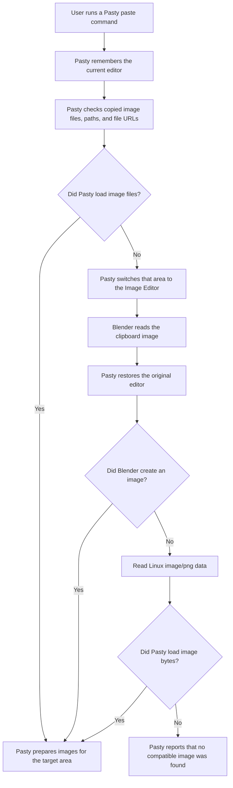

# Technical design

Pasty is a Blender extension for pasting images from the system clipboard into common Blender work areas.

| Area          | Result             |
| ------------- | ------------------ |
| 3D View       | Reference image    |
| 3D View       | Mesh plane         |
| Sequencer     | Image strip        |
| Shader Editor | Image texture node |

For the product principles behind these choices, see [product-design.md](product-design.md).

## Core idea

Pasty treats a paste as two steps:

1. Find the best image source from the clipboard.
2. Prepare that image for the target Blender area.

The source order is intentional:

```text
copied image files
Blender clipboard image
Linux image/png fallback
```

Copied files are checked first because they keep names, formats, paths, and multi-file selections. Pasty can find copied files through native file-list formats, plain paths, or `file://` URLs.

If no copied image files are found, Pasty uses Blender's own image clipboard operator:

```python
bpy.ops.image.clipboard_paste()
```

Pasty lets Blender own normal image clipboard reading. On Linux, after Blender fails, Pasty can read `image/png` through `wl-paste` or `xclip`. This covers Linux clipboard sessions where Blender does not provide image pixels.

Copied file support has two layers. Pasty reads native copied-file formats where they preserve more information, and also reads Blender's text clipboard for image file paths and `file://` URLs. Several paths become several pasted images.

The platform layer stays narrow:

- Windows reads `CF_HDROP`, the standard copied-file list from Explorer.
- macOS reads pasteboard file URLs through `/usr/bin/osascript` and AppKit.
- Linux reads `text/uri-list` and `x-special/gnome-copied-files` through `wl-paste` or `xclip` when those tools are installed.
- Linux reads and writes `image/png` through `wl-paste`, `wl-copy`, or `xclip` only after Blender native image paste or copy fails.

If those readers fail or are not available, Pasty falls back quietly.

This matters because clipboard image handling is different across macOS, Windows, Linux X11, Linux Wayland, screenshots, browsers, Photoshop, ShareX, and copied image files. Pasty keeps platform code narrow by letting Blender handle image clipboard support first.

## Paste flow

Blender's image clipboard paste operator belongs to the Image Editor. If Pasty needs Blender to read a copied screenshot or copied browser image while the user is in the 3D View, Sequencer, or Shader Editor, Pasty briefly switches the current area to the Image Editor, runs Blender's paste command, then switches the area back.



The shared paste path lives in `temporary_image_editor()`, `paste_images_from_clipboard()`, and the image file helpers in `addon/clipboard.py`.

`addon/storage.py` owns what happens after a source is found:

- use the original file
- pack into the `.blend`
- save to the pasted images folder
- save to Blender's temporary folder
- gather pasted images beside the `.blend`

The editor-specific behavior lives with the editor it changes:

- `addon/areas/view_3d.py`
- `addon/areas/shader_editor.py`
- `addon/areas/sequencer.py`

`addon/preferences.py` owns the small preferences panel and the generated filename template renderer. Storage uses that renderer, so the preview in preferences and the actual saved file names mean the same thing.

`addon/registration.py` owns classes, menus, and shortcuts.

## Poll rules

Blender calls an operator's `poll()` method to decide whether a button, menu item, or shortcut should be enabled.

Pasty keeps `poll()` simple. It only checks the current editor and mode.

For example, a 3D View paste operator checks that Blender is in the 3D View and Object Mode. A Shader Editor paste operator checks that the current node editor has an active node tree.

Pasty does not check the clipboard inside `poll()`.

That is intentional. Checking the clipboard would require temporarily switching the current area to the Image Editor. Blender may call `poll()` often while drawing UI, so changing editors there can cause flicker or strange behavior.

Clipboard work only happens when the user actually runs a paste command.

## 3D view reference paste

When you paste as a reference, Pasty gets an image from copied files or from Blender's clipboard paste, prepares storage, adds an Image Empty in the 3D View, and assigns the pasted image to that Empty. The result is a normal Blender image reference object.

If several image files are copied, Pasty creates one reference object per image and offsets them slightly.

## 3D view mesh plane paste

When you paste as a mesh plane, Pasty first creates the same image reference object. It then asks Blender to convert that selected reference image into a textured mesh plane.

Pasty uses Blender's built-in operator:

```python
bpy.ops.image.convert_to_mesh_plane()
```

This is better than manually building the mesh, material, UVs, and texture node setup. Blender already owns that behavior.

If several image files are copied, Pasty creates one mesh plane per image and offsets them slightly.

## Shader editor paste

When you paste in the Shader Editor, Pasty uses the current node selection:

- If an Image Texture node is selected, Pasty replaces that node's image.
- If a Principled BSDF node is selected, Pasty links the image color to Base Color.
- Otherwise Pasty creates an Image Texture node at the cursor.

If several image files are copied, Pasty creates a vertical stack of image texture nodes. If an Image Texture node is selected, the first image replaces it and the remaining images become nearby nodes.

## Sequencer paste

The Sequencer is different.

Sequencer image strips need a real image file path.

So Sequencer paste has one extra storage step: every pasted image must resolve to a file path before Pasty creates the image strip.

If the image came from a file path, Pasty uses the original path by default.

If the image came from Blender's clipboard paste or the Linux image/png fallback, Pasty saves the pasted image as a PNG.

If several image files are copied, Pasty creates strips in a row starting at the current frame.

Generated clipboard file names use the preference template:

```text
pasted-{date}-{time}-{number}
```

The template is the file name stem. Pasty always adds the fixed `.png` suffix because generated clipboard files are saved as PNG.

The supported tokens are `{date}`, `{time}`, `{number}`, `{number:4}`, `{blend}`, `{year}`, `{month}`, `{day}`, `{hour}`, `{minute}`, and `{second}`. Date and time tokens use the user's local clock. `{number:4}` means a four-digit number such as `0001`. These cover the common naming patterns without turning the add-on into a file naming language.

If a generated file name already exists, Pasty appends a number such as `-002`. It never overwrites existing files.

If the `.blend` file is saved, Pasty writes to:

```text
//pasted-images
```

That means a `pasted-images` folder next to the `.blend` file.

If the `.blend` file has not been saved yet, Pasty writes to Blender's temporary folder and marks those files so `Gather Pasted Images` can move them later.

Because of this, the extension manifest declares both permissions:

```toml
[permissions]
clipboard = "Copy and paste images to/from the system clipboard"
files = "Load image files and save generated clipboard images"
```

## Comparison with ImagePaste

[ImagePaste](https://github.com/b-init/ImagePaste) is the older Blender add-on in this space. Its README says it supports pasting images into the Image Editor, Video Sequencer, Shader Editor, and 3D Viewport. It also says the add-on is expected to be deprecated as the functionality is integrated into Blender.

ImagePaste reads the operating system clipboard with platform-specific code, saves an image file, then loads that file into Blender.

It has separate clipboard code for each platform:

- macOS uses a native pasteboard module plus `osascript`
- Linux uses a bundled `xclip` binary
- Windows uses PowerShell and .NET clipboard APIs

That approach made sense before Blender had better built-in image clipboard support, but it creates many moving parts.

Pasty uses copied image files first, then asks Blender to read the clipboard image. It saves a file only when the target requires a file path or when the user chooses `Save to Folder`.

The goal is not to become a bigger ImagePaste. The goal is to be smaller, more native to modern Blender, and less platform-fragile.

## Why Pasty uses Blender clipboard support

These ImagePaste issues show where platform clipboard code and older Blender APIs can break. These examples were checked on May 31, 2026.

- macOS native pasteboard import failures: [#55](https://github.com/b-init/ImagePaste/issues/55), [#60](https://github.com/b-init/ImagePaste/issues/60), [#61](https://github.com/b-init/ImagePaste/issues/61)
- Linux `xclip` or process failures: [#35](https://github.com/b-init/ImagePaste/issues/35), [#51](https://github.com/b-init/ImagePaste/issues/51), [#62](https://github.com/b-init/ImagePaste/issues/62)
- Windows clipboard format gaps: [#23](https://github.com/b-init/ImagePaste/issues/23), [#38](https://github.com/b-init/ImagePaste/issues/38), [#39](https://github.com/b-init/ImagePaste/issues/39)
- Blender API churn around reference images and image planes: [#56](https://github.com/b-init/ImagePaste/issues/56), [#59](https://github.com/b-init/ImagePaste/issues/59), [#66](https://github.com/b-init/ImagePaste/issues/66)
- Blender 5 Sequencer API breakage: [#65](https://github.com/b-init/ImagePaste/issues/65)
- Save-handler/operator breakage in Blender 4.5: [#64](https://github.com/b-init/ImagePaste/issues/64)
- Unclear save folder behavior: [#26](https://github.com/b-init/ImagePaste/issues/26)

Pasty avoids most of this by not owning a broad platform image extraction stack. Blender owns clipboard image reading first. Pasty adds small copied-file readers so file-manager copies keep their original paths, names, formats, and multi-file selection. Pasty also has a narrow Linux `image/png` fallback for the cases Blender can miss.

## What Pasty does not try to do

Pasty intentionally does not try to be a full ImagePaste clone.

It does not support:

- broad OS-specific image clipboard extraction
- moving user-owned files
- moving all images in a `.blend`
- save-time file moving
- SVG or text clipboard handling

Those features can be added later, but they should be added only when they fit the small native design. The existing Linux fallback is intentionally smaller than a general clipboard backend: it reads only Linux `image/png` through standard desktop tools, and only after Blender native paste fails.

## Current limits

Pasty depends on Blender's own image clipboard support.

That means behavior can differ by platform. Blender's image clipboard support is strongest on Windows, macOS, and Linux Wayland.

Multiple-image paste works for copied file lists, clipboard text that exposes several image paths, or several file URLs. It does not mean Blender's native image clipboard operator can read several clipboard images at once.

Windows and macOS screenshot and browser image paste depend on Blender's native image clipboard support. Linux X11 screenshot and browser image paste is supported when `xclip` is installed and the clipboard offers `image/png`. Linux Wayland can use `wl-clipboard` for the same fallback if Blender misses the clipboard image. If the Linux tool is missing, Pasty shows an install hint. If the tool exists but the clipboard does not offer PNG data, Pasty keeps the normal "No compatible image" behavior.

This keeps Blender as the owner of normal image clipboard support while Pasty covers copied-file paths and the small Linux image/png gap.

## Design rules

- Use Blender's own operators when Blender already owns the behavior.
- Read native copied-file lists only to preserve file paths and multi-file paste.
- Read image bytes only as a Linux fallback after Blender native image paste fails.
- Find Linux clipboard tools through `PATH` so no path preference is needed.
- Do not switch editor areas inside `poll()`.
- Treat copied files and copied pixels as different sources.
- Never move a user-owned file.
- Let `storage.py` own pack, save, temporary-folder, and gather decisions.
- Keep the add-on small. A paste utility should not become a clipboard framework.

## Testing

Headless tests check:

- the add-on imports
- operators are registered
- operators are unregistered
- generated images can be saved to disk
- image file paths, `file://` URLs, `text/uri-list`, and GNOME copied-file text can be loaded
- multiple image file paths create multiple target items
- gathered images are copied beside the `.blend` without moving user files
- Linux image/png paste and copy fallback behavior can work with mocked readers and writers

Live clipboard tests use a seed and verify split:

- `checks/clipboard_os.py` seeds or checks the real OS clipboard.
- `checks/clipboard_blender.py` runs inside Blender and checks Pasty behavior.

Shared add-on behavior checks live in `checks/addon_behavior.py`. `checks/source_addon.py` runs those checks against the source checkout, and `checks/installed_addon.py` runs the same checks against the installed zip.

The live scenarios are:

- `copied-files`: two fixture files paste as `SOURCE_COPIED_FILE`.
- `paste-image`: one seeded PNG pastes as `SOURCE_CLIPBOARD_IMAGE`.
- `copy-image`: Blender copies an image after a real GUI input event, and the OS helper verifies image data on the clipboard while Blender stays open.

The full hosted CI profile runs those live scenarios on Linux X11 across Blender 4.2, 4.5, and 5.1, and on Linux Wayland across Blender 4.2 and 5.1. Blender 4.5 is not a hosted Linux Wayland live clipboard gate because Blender exits in headless Sway during image paste before Pasty can write a result. macOS and Windows still run headless Blender checks in hosted CI. Live clipboard checks on those platforms stay local until the project has real desktop runners.

## References

- [Blender image operators](https://docs.blender.org/api/4.2/bpy.ops.image.html)
- [Blender extension manifest permissions](https://docs.blender.org/manual/en/4.2/advanced/extensions/getting_started.html)
- [Microsoft Shell Clipboard Formats](https://learn.microsoft.com/en-us/windows/win32/shell/clipboard)
- [Apple NSPasteboard](https://developer.apple.com/documentation/AppKit/NSPasteboard)
- [wl-paste manual](https://man.archlinux.org/man/wl-paste.1.en)
- [ImagePaste repository](https://github.com/b-init/ImagePaste)
- [ImagePaste operators](https://github.com/b-init/ImagePaste/blob/main/imagepaste/operators.py)
- [ImagePaste macOS clipboard code](https://github.com/b-init/ImagePaste/blob/main/imagepaste/clipboard/darwin/darwin.py)
- [ImagePaste Linux clipboard code](https://github.com/b-init/ImagePaste/blob/main/imagepaste/clipboard/linux/linux.py)
- [ImagePaste Windows clipboard code](https://github.com/b-init/ImagePaste/blob/main/imagepaste/clipboard/windows/windows.py)
