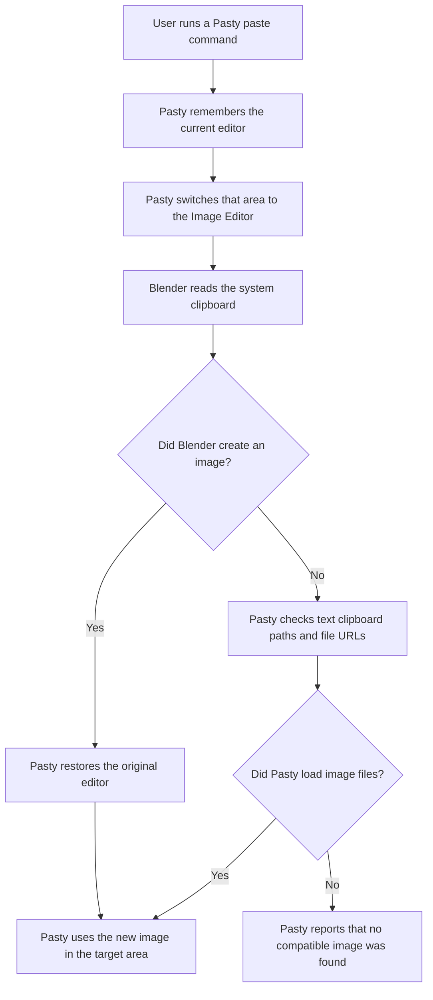

# Technical design

Pasty is a Blender extension for pasting image data from the system clipboard into common Blender work areas.

| Area          | Result             |
| ------------- | ------------------ |
| 3D View       | Reference image    |
| 3D View       | Mesh plane         |
| Sequencer     | Image strip        |
| Shader Editor | Image texture node |

## Core idea

Pasty uses Blender's own image clipboard operator:

```python
bpy.ops.image.clipboard_paste()
```

That is the main design choice.

Pasty does not try to read the operating system image clipboard itself. It lets Blender do that work.

If Blender does not find image data, Pasty checks Blender's plain text clipboard for image file paths and `file://` URLs. Several paths become several pasted images. That keeps copied-path workflows useful without adding a platform-specific clipboard layer.

This matters because clipboard image handling is different across macOS, Windows, Linux X11, Linux Wayland, screenshots, browsers, Photoshop, ShareX, and copied image files. Rebuilding all of that inside the add-on creates a lot of fragile platform code.

## Paste flow

Blender's image clipboard paste operator belongs to the Image Editor. If the user is in the 3D View, Sequencer, or Shader Editor, Pasty briefly switches the current area to the Image Editor, runs Blender's paste command, then switches the area back.



The shared paste path lives in `temporary_image_editor()`, `paste_images_from_clipboard()`, and the image file helpers in `addon/clipboard.py`.

The editor-specific behavior lives with the editor it changes:

- `addon/areas/view_3d.py`
- `addon/areas/shader_editor.py`
- `addon/areas/sequencer.py`

`addon/registration.py` owns classes, menus, and shortcuts.

## Poll rules

Blender calls an operator's `poll()` method to decide whether a button, menu item, or shortcut should be enabled.

Pasty keeps `poll()` simple. It only checks the current editor and mode.

For example, a 3D View paste operator checks that Blender is in the 3D View and Object Mode. A Shader Editor paste operator checks that the current node editor has an active node tree.

Pasty does not check the clipboard inside `poll()`.

That is intentional. Checking the clipboard would require temporarily switching the current area to the Image Editor. Blender may call `poll()` often while drawing UI, so changing editors there can cause flicker or strange behavior.

Clipboard work only happens when the user actually runs a paste command.

## 3D view reference paste

When you paste as a reference, Pasty asks Blender to create an image from the clipboard, adds an Image Empty in the 3D View, and assigns the pasted image to that Empty. The result is a normal Blender image reference object.

If the clipboard fallback finds several image files, Pasty creates one reference object per image and offsets them slightly.

## 3D view mesh plane paste

When you paste as a mesh plane, Pasty first creates the same image reference object. It then asks Blender to convert that selected reference image into a textured mesh plane.

Pasty uses Blender's built-in operator:

```python
bpy.ops.image.convert_to_mesh_plane()
```

This is better than manually building the mesh, material, UVs, and texture node setup. Blender already owns that behavior.

If the clipboard fallback finds several image files, Pasty creates one mesh plane per image and offsets them slightly.

## Shader editor paste

When you paste in the Shader Editor, Pasty uses the current node selection:

- If an Image Texture node is selected, Pasty replaces that node's image.
- Otherwise Pasty creates an Image Texture node at the cursor.
- If a Principled BSDF node is selected, Pasty links the image color to Base Color.

If the clipboard fallback finds several image files, Pasty creates a vertical stack of image texture nodes. If an Image Texture node is selected, the first image replaces it and the remaining images become nearby nodes.

## Sequencer paste

The Sequencer is different.

Blender's clipboard paste creates a generated image data-block. A data-block is Blender's internal object for data such as images, meshes, and materials. A generated image can exist inside Blender without a real file path.

Sequencer image strips need a real image file path.

So Sequencer paste has one extra step for generated images: Pasty saves the pasted image as a PNG before it creates the image strip. If the image came from a file path, Pasty reuses that path.

If the clipboard fallback finds several image files, Pasty creates strips in a row starting at the current frame.

If the `.blend` file is saved, Pasty writes to:

```text
//pasty
```

That means a `pasty` folder next to the `.blend` file.

If the `.blend` file has not been saved yet, Pasty writes to the system temp folder.

Because of this, the extension manifest declares both permissions:

```toml
[permissions]
clipboard = "Copy and paste images to/from the system clipboard"
files = "Load image files and save generated clipboard images"
```

## Comparison with ImagePaste

[ImagePaste](https://github.com/b-init/ImagePaste) is the older Blender add-on in this space. Its README says it supports pasting images into the Image Editor, Video Sequencer, Shader Editor, and 3D Viewport. It also says the add-on is expected to be deprecated as the functionality is integrated into Blender.

ImagePaste reads the operating system clipboard with platform-specific code, saves an image file, then loads that file into Blender.

It has separate clipboard code for each platform:

- macOS uses a native pasteboard module plus `osascript`
- Linux uses a bundled `xclip` binary
- Windows uses PowerShell and .NET clipboard APIs

That approach made sense before Blender had better built-in image clipboard support, but it creates many moving parts.

Pasty asks Blender to read the clipboard, receives a Blender image data-block, and uses that image directly. It falls back to plain text paths or file URLs only when Blender does not find image data. It saves a file only when Sequencer needs one.

The goal is not to become a bigger ImagePaste. The goal is to be smaller, more native to modern Blender, and less platform-fragile.

## ImagePaste problems this design avoids

ImagePaste's public issue tracker shows the cost of owning platform clipboard code and old Blender APIs. These examples were checked on May 31, 2026.

- macOS native pasteboard import failures: [#55](https://github.com/b-init/ImagePaste/issues/55), [#60](https://github.com/b-init/ImagePaste/issues/60), [#61](https://github.com/b-init/ImagePaste/issues/61)
- Linux `xclip` or process failures: [#35](https://github.com/b-init/ImagePaste/issues/35), [#51](https://github.com/b-init/ImagePaste/issues/51), [#62](https://github.com/b-init/ImagePaste/issues/62)
- Windows clipboard format gaps: [#23](https://github.com/b-init/ImagePaste/issues/23), [#38](https://github.com/b-init/ImagePaste/issues/38), [#39](https://github.com/b-init/ImagePaste/issues/39)
- Blender API churn around reference images and image planes: [#56](https://github.com/b-init/ImagePaste/issues/56), [#59](https://github.com/b-init/ImagePaste/issues/59), [#66](https://github.com/b-init/ImagePaste/issues/66)
- Blender 5 Sequencer API breakage: [#65](https://github.com/b-init/ImagePaste/issues/65)
- Save-handler/operator breakage in Blender 4.5: [#64](https://github.com/b-init/ImagePaste/issues/64)
- Unclear save folder behavior: [#26](https://github.com/b-init/ImagePaste/issues/26)

Pasty avoids most of this by not owning platform clipboard extraction. Blender owns clipboard image reading. Pasty only decides what to do with the pasted Blender image, or with image file paths exposed through Blender's text clipboard.

## What Pasty does not try to do

Pasty intentionally does not try to be a full ImagePaste clone.

It does not currently support:

- custom file naming preferences
- moving pasted images after save
- packing pasted images into the `.blend`
- OS-specific file-drop clipboard formats beyond text paths and file URLs
- SVG or text clipboard handling

Those features can be added later, but they should be added only when they fit the small native design.

## Current limits

Pasty depends on Blender's own clipboard support.

That means behavior can differ by platform. Blender's image clipboard support is strongest on Windows, macOS, and Linux Wayland.

Multiple-image paste works for clipboard text that exposes several image paths or file URLs. It does not mean Blender's native image clipboard operator can read several raw clipboard images at once.

Linux X11 may be weaker depending on Blender and the desktop environment.

This is still better than shipping our own Linux clipboard stack, because Blender itself is the owner of clipboard support.

## Design rules

- Use Blender's own operators when Blender already owns the behavior.
- Do not read the operating system clipboard directly unless Blender's own API cannot do the job.
- Do not switch editor areas inside `poll()`.
- Only write files when Blender needs a real file path.
- Keep the add-on small. A paste utility should not become a clipboard framework.

## Testing

Headless tests can check:

- the add-on imports
- operators are registered
- operators are unregistered
- generated images can be saved to disk
- image file paths and file URLs can be loaded
- multiple image file paths create multiple target items

Real clipboard behavior needs a local GUI smoke test, because headless Blender cannot fully prove system clipboard behavior. Hosted GitHub runners do not give us a stable system clipboard.

Manual GUI checks should cover copying an image to the clipboard, then pasting as a 3D reference, as a 3D plane, into the Sequencer, and into the Shader Editor.

## References

- [Blender image operators](https://docs.blender.org/api/4.2/bpy.ops.image.html)
- [Blender extension manifest permissions](https://docs.blender.org/manual/en/4.2/advanced/extensions/getting_started.html)
- [ImagePaste repository](https://github.com/b-init/ImagePaste)
- [ImagePaste operators](https://github.com/b-init/ImagePaste/blob/main/imagepaste/operators.py)
- [ImagePaste macOS clipboard code](https://github.com/b-init/ImagePaste/blob/main/imagepaste/clipboard/darwin/darwin.py)
- [ImagePaste Linux clipboard code](https://github.com/b-init/ImagePaste/blob/main/imagepaste/clipboard/linux/linux.py)
- [ImagePaste Windows clipboard code](https://github.com/b-init/ImagePaste/blob/main/imagepaste/clipboard/windows/windows.py)
